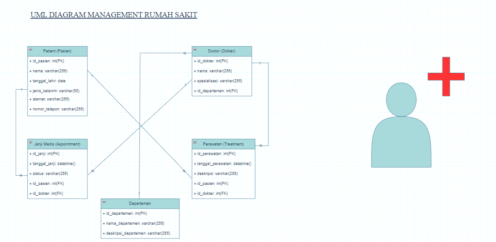
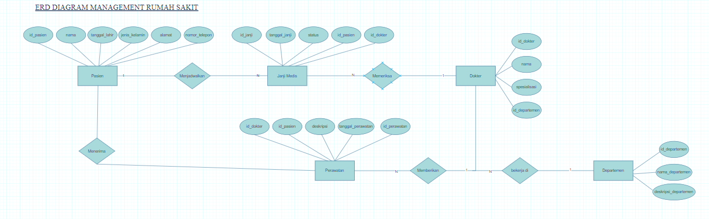
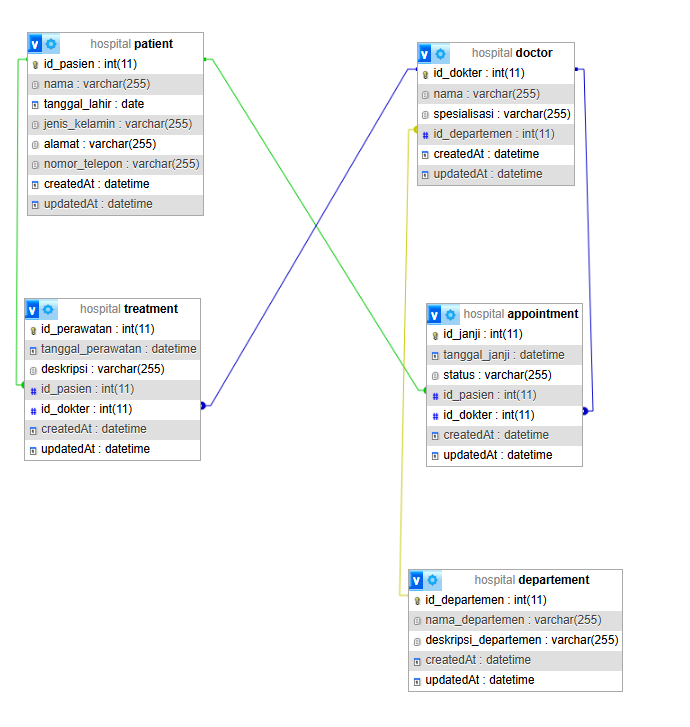

# CASE PROJECT : MANAJEMEN RUMAH SAKIT 🏥

Deskripsi: Project ini bertujuan untuk membangun sistem manajemen rumah sakit yang berfungsi untuk memanage dokter, pasien, departemen, janji temu (appointment), dan transaksi pembayaran. Sistem ini akan memfasilitasi pengelolaan interaksi antara dokter, pasien, dan departemen yang mereka wakili, serta mengatur jadwal janji temu dan proses transaksi setelah layanan medis diberikan.

Project ini dibuat menggunakan teknologi Express.js dengan ORM Sequelize, serta mendukung operasi CRUD (Create, Read, Update, Delete) untuk setiap entitas dalam sistem.

# DESKRIPSI CASE 💊

Dalam project ini terdapat beberapa entitas utama yang berhubungan satu sama lain:

1. Dokter (Doctor): Dokter yang bertugas di rumah sakit.
2. Pasien (Patient): Pasien yang berobat di rumah sakit.
3. Departemen (Department): Bagian atau unit di rumah sakit tempat dokter bekerja, seperti kardiologi, neurologi, dll.
4. Janji Temu (Appointment): Jadwal pertemuan antara pasien dan dokter.
5. Transaksi (Payment): Pembayaran yang dilakukan pasien setelah menerima layanan medis.

# RELASI ANTAR ENTITAS ✍️

1.Pasien ke Janji Medis (Appointment):
- Setiap pasien (Pasien) dapat memiliki satu atau lebih janji medis (Janji Medis).
- Relasi: One-to-Many

2.Dokter ke Janji Medis:
- Setiap dokter (Dokter) bisa terlibat dalam satu atau lebih janji medis.
- Relasi: One-to-Many

3.Pasien ke Perawatan (Treatment):
- Setiap pasien dapat menerima satu atau lebih perawatan.
- Relasi: One-to-Many

4.Dokter ke Perawatan:
- Setiap dokter dapat memberikan perawatan kepada satu atau lebih pasien.
- Relasi: One-to-Many

5.Dokter ke Departemen:
- Setiap dokter bekerja di satu departemen.
- Relasi: Many-to-One

## Dependecies / Teknologi yang digunakan 💻

1. **npm init -y**

    Perintah ini digunakan untuk secara otomatis menginisialisasi dan membuat file `package.json`

    ```bash
    npm init -y
    ```

2. **express**

    Express JS sebagai framework Node.js untuk mengelola request dan response HTTP

    ```bash
   npm i express
    ```

3. **mysql**

    package untuk melakukan koneksi ke database

    ```bash
    npm i mysql
    ```

4. **dotenv**

    Dotenv untuk mengatur variabel lingkungan
    ```bash
    npm i dotenv
    ```

5. **cors**

    Untuk memberikan akses pada frontEnd

    ```bash
    npm i cors
    ```
6. **sequelize**

    Sebagai Orm yang dipakai

    ```bash
    npm i sequelize
    ```


7. **nodemon**

    jalankan dengan mengetikan perintah (nodemon namaFile)

    ```bash
    npm install nodemon
    ```

    Perintah ini akan menjalankan server secara terus menerus

    Aplikasi akan berjalan pada port yang ditentukan di file `.env` .

Untuk menginstal semua dependensi ini sekaligus, Anda bisa menjalankan perintah berikut di terminal di direktori proyek Anda:

```bash
npm install body-parser cors dotenv express mysql nodemon sequelize
```

<br>
    

# CLASS DIAGRAM 

 
# ERD (Entity Relationship Diagram) 


<br>

# RELASI TABLE


<br>

# COPYRIGHT BY 🐣🐣
```
Nama : Israruddin ...
Kelas : XII PPLG .. 
Mapel : Produktif PPLG ...
Tugas : Sequelize ...
```


